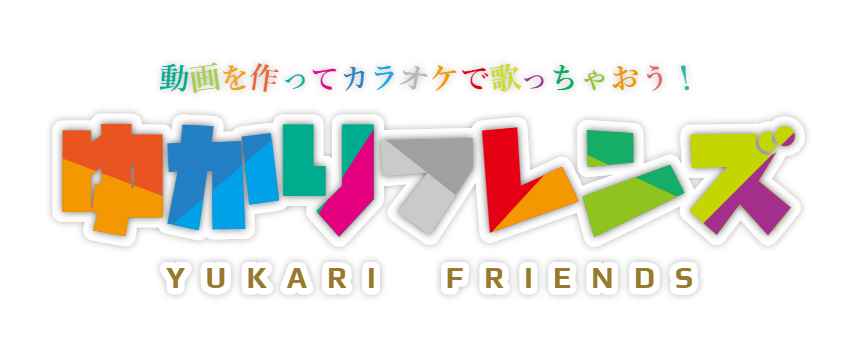

ゆかり
==============================================

「ゆかり」(Universal KAraoke REquest Web tool) は  
持ち込みカラオケを行う際に、カラオケ動画をブラウザ上でリクエストをするためツールです。

## 目次
- [目的](#目的)
- [できること](#できること)
- [必要な環境](#必要な環境)
- [セットアップ](#セットアップ)
- [更新履歴](#更新履歴)
- [ライセンス](#ライセンス)

# 目的
持ち込みカラオケをする際に、参加者が手持ちのスマホ等でカラオケのデンモクのように曲を検索して予約できるようにする  
その他参加者が曲選択できるイベントとかでも

# できること

## 持ち込み曲関連
- 事前に登録作業など不要で、動画ファイルを入れたディスクを持ち寄って使用可能(ファイル名に少なくとも曲名が付いていること)
- 動画ファイルだけでなくmp3+タイムタグ付き歌詞ファイルも使用可能
- 参加者の手持ちの端末内の動画ファイルをアップロードしてリクエスト予約可能
- youtubeのURLを指定してリクエスト予約可能 ※

## リクエスト予約関連
- 参加者が手持ちの端末のブラウザから動画を検索しリクエストとして予約
- アニソンに関しては、作品名、歌手名(その他製作者も)、ブランド名から検索可能(anison.infoのサイトの情報を使用) ※
- アニソンDB「ゆかりすたー(ListerDB)」と連携し、作品名・歌手名・ファイル名等から検索可能
- 参加者がカラオケ配信曲を歌いたい場合は、「配信曲を歌う」とリクエストしておくと自分の番になるとカラオケ配信の画面＆音声に自動切替
- リクエスト予約された曲を順番の入れ替え可能
- 予約時にキーチェンジ(移調)、音声トラック、音ズレ補正、音量、ループ再生などを指定可能

## 再生関連
- リクエスト予約された曲を順番に自動再生
- 参加者が手持ちの端末から、再生中のPlayerの音量調節、再生停止再開、音声トラック変更(OnVocal/OffVocal等)等の操作可能
- 参加者が手持ちの端末から、ニコ生風にコメントを画面に流すことが可能 ※

## マイページ機能
- 端末ごとに自動発行されるIDで、リクエスト履歴・お気に入り曲・「あとで歌う」リスト・お気に入り検索ワードを保存
- Google Drive連携でマイページのデータを複数端末間で同期 ※
- デバイスペアリングコードで別ブラウザ・別端末へアカウントを引き継ぎ

## 画面・操作性
- スマホで使いやすいモダンなUI(Bootstrap 5)
- ダークモード／ライトモード切り替え、文字サイズ変更に対応
- スワイプ操作対応の予約一覧
- 背景画像の設定(PC／スマホ別画像、カード・背景の透過度を個別調整)
- 接続情報ページ：接続URLとWiFi接続用QRコードをまとめて表示

## カラオケ配信曲中BGV(バックグラウンド動画)機能
- 曲中BGVを入力可能なカラオケ機の場合、配信曲中の映像のバックに持ち込んだ動画を流すことが可能
- 曲中BGVをブルーバックにできるカラオケ機の場合、HDMIミキサー「Blackmagic ATEM Mini シリーズ」の映像合成機能により配信のカラオケ字幕の後ろに持ち込んだ動画を流すことが可能
(この場合カラオケ動画も配信もフルHDで表示可能)

## その他
- 機材係は動作中は一切持ち込み用PCを操作する必要なし

※の機能はインターネット接続環境が必要

# 必要な環境

## 機材
- **Windows PC** — TV出力(HDMI出力)ができて、セカンダリモニタで動画が問題なく再生できる性能のあるもの。Atom系CPUのPCじゃなければ大抵大丈夫(それで動かなかったらWindowsをクリーンインストール推奨)
- **WiFiアクセスポイント** — 少人数の場合スマホテザリングでも可能

あれば便利なもの
- **HDMIミキサー Blackmagic ATEM Mini シリーズ** — 配信とカラオケ動画の切り替えに使用し、配信時に任意の動画をBGV(バックグラウンド動画)として使用できる

## ソフトウェア
- ファイル検索ソフト [Everything File Search](http://www.voidtools.com/,"everything")(ゆかりすたーDB利用時は任意)
- Web Server [xampp](https://www.apachefriends.org/jp/index.html)
- PHP実行環境 ( xamppに同梱 )
- 動画Player [MediaPlayerClassic BE](http://sourceforge.net/projects/mpcbe/)
- 音楽Player [foobar2000](https://www.foobar2000.org/) with foo_httpcontrol [plugin](https://bitbucket.org/oblikoamorale/foo_httpcontrol/wiki/Home)

> 画面は従来デザイン(Bootstrap 3)と新デザイン(Bootstrap 5)が併存しており、設定で新UIに切り替えられます。

# セットアップ

使用方法は
http://bee7813993.github.io/KaraokeRequestorWeb/
を参照してください。

最初のセットアップがそこそこ面倒なことが分かったので、
簡単にセットアップツールができるまで、Windowsのリモートアシスタンスでセットアップのお手伝いをしようと思います。
何らかの方法(twitter,mixi,facebookなど)で私に連絡を取ってもらえればお手伝いしますのでご連絡お待ちしています。

# 更新履歴

これまでの変更履歴は [CHANGELOG.md](CHANGELOG.md) を参照してください。

# ライセンス

本プロジェクトは BSD 3-Clause License で公開されています。詳細は [LICENSE](LICENSE) を参照してください。

---

上のロゴは
https://aratama.github.io/kemonogen/
を使用して、「楽シャア」さんが作ってくれました。
